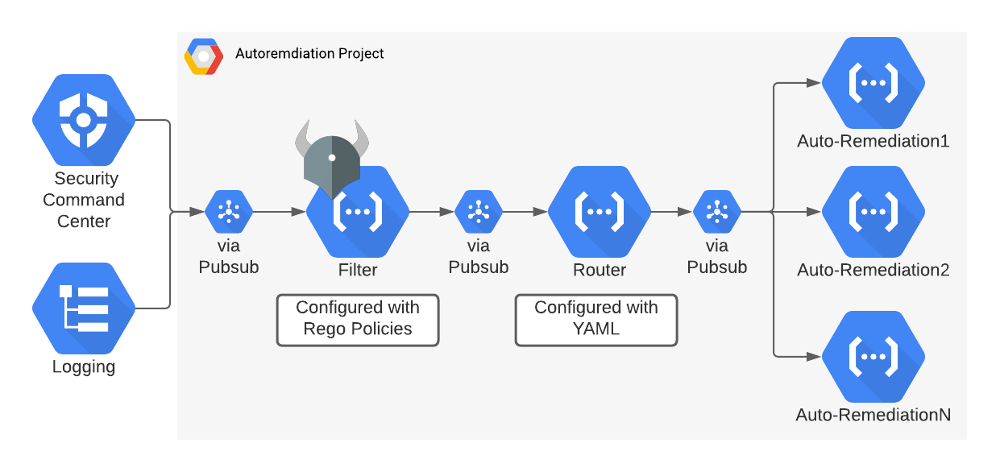

# Security Response Automation

Take automated actions on your Security Command Center findings:

- Automatically create disk snapshots to enable forensic investigations.
- Revoke IAM grants that violate your desired policy.
- Notify other systems such as PagerDuty, Slack or email.
- See the full list of [automations](/automations.md) for more information.

You're in control:

- Service account runs with lowest permission needed granted at granularity you specify.
- You control which projects are enforced by each automation.
- Every action is logged to StackDriver and is easily auditable.
- Can be run in monitor mode where actions are logged only.

## Architecture


1. A finding is either generated from Security Command Center or Cloud Logging (legacy) and sent to a Pubsub topic
2. The Filter Cloud Function first can optionally run the finding through a series of Rego policies that will automatically mark the finding as a false positive and auto-close it.
3. If the finding is valid for your environment, it is sent to the Router Function, which is configued by YAML to send the finding on to the correct auto-remediation function that you have enabled.
4. The auto-remediation Cloud Functions then take action to fix the problem addressed with the finding.

### Automations

|Function Name|Service|Description|
|----|----|----|
|CloseBucket|GCS|Removes public access for a GCS bucket|
|CloseCloudSQL|CloudSQL|Removes public access for a Cloud SQL instance|
|ClosePublicDataset|BigQuery|Removes public access for a BigQuery Dataset|
|CloudSQLRequireSSL|Cloud SQL|Automatically configure a Cloud SQL instance to require encryption in transit|
|DisableDashboard|Google Kubernetes Engine|Disables the GKE dashboard|
|EnableAuditLogs|IAM|Enables Data Access logs|
|EnableBucketOnlyPolicy|IAM|Enables Uniform Bucket Access on the bucket in question|
|IAMRevoke|IAM|Revokes IAM permissions granted by an anomolous grant|
|OpenFirewall|Compute Engine|Closes an firewall rule that has 0.0.0.0/0 ingress open|
|RemovePublicIP|Compute Engine|Removes external IP from a GCE instance|
|SnapshotDisk|Compute Engine|Creates a disk snapshot in response to a C2 finding|
|UpdatePassword|Cloud SQL|Updates the Cloud SQL root password|

---

## Configuration
### Filter

_NOTE: Filters are only supported if using SCC Notifications_

Sometimes in your environment, you'll run into a scenario where a finding is a false positive because it is expected in your environment. In this case, we use the Filter Cloud Function to automatically mark findings as false positives in SCC and then set them as INACTIVE so you don't have to alert on them. To filter, we use a common policy language used in other Google Cloud open source called [Rego](https://www.openpolicyagent.org/docs/latest/#rego) from the good folks at [Open Policy Agent](https://www.openpolicyagent.org/).

To add your own Rego files simply add them in `./config/filters`. The Cloud Function will pick up any files with the `.rego` extension except `*_test.rego` so please also add tests. Each file must have a single "rule" where `deny` is true (and the finding is filtered) if the block evaluates to `true`. For example, let's say in a particular project that is low risk, we want to filter out Bad IP findings that look like a valid NTP request, since many times they are. The rego would look like this:

```rego
# filename: ntpd.rego

package sra.filter

ntpd {
	ipcon := input.finding.sourceProperties.properties.ipConnection
	ipcon.destPort == 123
	ipcon.protocol == 17
}
```

A few notes on the syntax:

1. The package name must be `sra.filter` and the rule must match the filename (without the extension) since the query the Cloud Function
uses is `data.sra.filter.<filename-without-extension>`
2. Rego's entry point is called "input" so since the finding JSON has a root node of "finding", we'll address it by `input.finding` and then all the nested fields beneath it.
3. You can think of each line in a block as a boolean condition that is AND'ed together. So below we are asserting the destPort must equal 123 and the protocol must equal 17 (UDP) for this finding to be filtered out. For more on the Rego syntax see: [https://godoc.org/github.com/open-policy-agent/opa/rego](https://godoc.org/github.com/open-policy-agent/opa/rego)

#### Testing Filters

OPA gives you the ability to test your Rego policies against actual JSON. To do this, simply add the Notification JSON structure into the test and make assertions against it. We give an example of this in `./config/filters/false_positive_test.rego`. You can run tests yourself  after you [download OPA](https://www.openpolicyagent.org/docs/latest/#running-opa) by trying the following:

```
cp config/filters/false_positive.rego config/filters/false_positive.rego
cp config/filters/false_positive_test.rego.sample config/filters/false_positive_test.rego
opa test config/filters
```

### Router

Before installation we'll configure our automations, copy `./config/sra.yaml.sample` to `./config/sra.yaml`. You can also view a mostly filled out [sample configuration file](https://github.com/GoogleCloudPlatform/security-response-automation/wiki/Sample-configuration). Within this file we'll define a few steps to get started:

- Which automations should apply to which findings.
- Which projects to target these automations with and which to exclude.
- Whether or not run in monitor mode (dry_run) where changes are only logged and not performed.
- Specify per automation configuration properties.

Every automation has a configuration similar to the following example:

```yaml
apiVersion: security-response-automation.cloud.google.com/v1alpha1
kind: Remediation
metadata:
  name: router
spec:
  parameters:
    etd:
      anomalous_iam:
        - action: iam_revoke
          target:
            - organizations/1234567891011/folders/424242424242/*
            - organizations/1234567891011/projects/applied-project
          excludes:
            - organizations/1234567891011/folders/424242424242/projects/non-applied-project
            - organizations/1234567891011/folders/424242424242/folders/565656565656/*
          properties:
            dry_run: true
            anomalous_iam:
              allow_domains:
                - foo.com
```

The first parameter represents the finding provider, `sha` (Security Health Analytics) or `etd` (Event Threat Detection).

Each provider lists findings which contain a list of automations to be applied to those findings. In this example we apply the `revoke_iam` automation to Event Threat Detection's Anomalous IAM Grant finding. For a full list of automations and their supported findings see [automations.md](automations.md).

The `target` and `exclude` arrays accepts an ancestry pattern that is compared against the incoming project. The target and exclude patterns are both considered however the excludes takes precedence. The ancestry pattern allows you to specify granularity at the [organization](https://cloud.google.com/resource-manager/docs/creating-managing-organization), [folder](https://cloud.google.com/resource-manager/docs/creating-managing-folders) and [project](https://cloud.google.com/resource-manager/docs/creating-managing-projects) level.

<table>
  <tr>
   <td>Pattern</td>
   <td>Description</td>
  </tr>
  <tr>
   <td>organizations/123</td>
   <td>All projects under the organization 123</td>
  </tr>
  <tr>
   <td>organizations/123/folders/456/&ast;</td>
   <td>Any project in folder 456 in organization 123</td>
  </tr>
  <tr>
   <td>organizations/123/folders/456/projects/789</td>
   <td>Apply to the project 789 in folder 456 in organization 123</td>
  </tr>
  <tr>
   <td>organizations/123/projects/789</td>
   <td>Apply to the project 789 in organization 123 that is not within a folder</td>
  </tr>
  <tr>
   <td>organizations/123/&ast;/projects/789</td>
   <td>Apply to the project 789 in organization 123 regardless if its in a folder or not</td>
  </tr>
</table>

All automations have the `dry_run` property that allow to see what actions would have been taken. This is recommend to confirm the actions taken are as expected. Once you have confirmed this by viewing logs in StackDriver you can change this property to false then redeploy the automations.

The `allow_domains` property is specific to the iam_revoke automation. To see examples of how to configure the other automations see the full [documentation](/automations.md).

## Configuring permissions

The service account is configured separately within [main.tf](/main.tf). Here we inform Terraform which folders we're enforcing so the required roles are automatically granted. You have a few choices for how to configure this step:

- **Recommended** Specify a list of folder IDs that SRA could grant its service account the necessary roles to. This ensures SRA only has the access it needs at the folders where it's being used. This list will be asked below in the **Installation** section.
- Grant permissions on your own either per project or at the organizational level.

## Installation

Following these instructions will deploy all automations. Before you get started be sure
you have the following installed:

- Go version 1.13
- Terraform version 0.12.17

```shell
gcloud auth login --update-adc
terraform init
terraform apply
```

If you don't want to install all automations you can specify certain automations individually by running `terraform apply --target module.revoke_iam_grants`. The module name for each automation is found in [main.tf](main.tf). Note the `module.filter` and `module.router` are required to be installed.

TIP: Instead of entering variables every time you can create `terraform.tfvars`
file and input key value pairs there, i.e.
`automation-project="aerial-jigsaw-235219"`.

If at any point you want to revert the changes we've made just run `terraform destroy .`

### Reinstalling a Cloud Function

Terraform will create or destroy everything by default. To redeploy a single Cloud Function you can do:

```shell
// revoke_iam_grants is the name of the Terraform module in `./main.tf`.
// IAMRevoke is the exported Cloud Function name in `exec.go`.
scripts/deploy.sh revoke_iam_grants IAMRevoke $PROJECT_ID
```

### Terraform Inputs

| Name | Description | Type | Default | Required |
|------|-------------|------|---------|:-----:|
| automation-project | Project ID where the Cloud Functions should be installed. | `string` | n/a | yes |
| enable-scc-notification | If true, create the notification config from SCC instead of Cloud Logging | `bool` | n/a | yes |
| findings-project | Project ID where Event Threat Detection security findings are sent to by the Security Command Center. Configured in the Google Cloud Console in Security > Threat Detection. | `string` | n/a | yes |
| folder-ids | Folder IDs to apply automations to. | `list(string)` | n/a | yes |
| organization-id | Organization ID. | `string` | n/a | yes |

### Logging

Each Cloud Function logs its actions to the below log location. This can be accessed by visiting
StackDriver and clicking on the arrow on the right hand side then 'Convert to advanced filter'.
Then paste in the below filter making sure to change the project ID to the project where your
Cloud Functions are installed.

## Forward findings to Pub/Sub

Currently Event Threat Detection publishes to StackDriver and Security Command Center, Security Health Analytics publishes to Security Command Center only. We're currently in the process of moving to Security Command Center notifications but for completeness sake we'll list instructions for StackDriver (legacy) and Security Command Center notifications.

### StackDriver

If you only want to process Event Threat Detection findings, then your configuration was done for you automatically by using Terraform. You can skip the **Set up Security Command Center Notifications** section.

**NOTE**:

If you set up Security Command Center notifications, you need to remove the StackDriver export so that automations are not triggered twice. To do this, run:

```shell
gcloud logging sinks delete sink-threat-findings --project=$PROJECT_ID
```

## Development

### Tools

Make sure you have installed the following tools for development and test:

* Go 1.13 or higher
* `terraform`
* `gocyclo`
* `golint`
* `golangci-lint`
* `pre-commit`
* `opa`
